 

 

 

# Welcome to Miguel's developer profile 👋

**🧪 Data Scientist** | **⚙️ Software Engineer** | **🎨 Web Developer**

```mermaid
classDiagram
    Miguel <|-- WebDeveloper
    Miguel <|-- SoftwareEngineer
    SoftwareEngineer <|-- DataScientist

    Miguel : 👨‍💻 🙋🏼‍♂️ 😀
    Miguel: +self-taught
    Miguel: +quick_learning()
    

    class WebDeveloper{
        💻🎨
        +studiedAt = "IES San Juan de la Cruz"
        +degreeType = "Ciclo Superior"
        +duration = "2018-2020 🎓"
        +buildResponsiveUI()
        +optimizePerformance()
    }

    class SoftwareEngineer{
        💻⚙️
        +studiedAt = "Universidad Politécnica de Madrid"
        +degreeType = "Grado Universitario"
        +duration = "2020-2024 🎓"
        +developScalableSystems()
        +writeEfficientAlgorithms()
        +debugComplexIssues()
    }

    class DataScientist{
        👨🏼‍🔬🤖🧠
        +studiedAt = "Universidad Politécnica de Madrid"
        +degreeType = "Máster Universitario"
        +duration = "2024-2025 🎓"
        +buildPredictiveModels()
        +analyzeLargeDatasets()
        +deployMLModels()
    }
```

## 🛠️ Tools

### 👨‍💻 Programming Languages

    
    
    
    

### 🧰 Frameworks and Libraries

    
    
    
    
    
    
    
    
    
    

### 🗄️ Databases

    
    

### 💻 Software and Tools

    
    
    
    
    
    

 

## My projects 💡
> ## ⚽ **Browers FC** webpage <a href="https://browers.es">browers.es</a>
> 

>     
>     Página web para seguir los partidos, noticias y estadísticas de un equipo de fútbol.
> 

> 
Release: <b>2023</b>

> ## 🤖 **@audiohilo** bot <a href="https://twitter.com/audiohilo">twitter.com/audiohilo</a>
> 

>     
>     Bot de Twitter para transcribir hilos en formato audible.   ⚠️ Lamentablemente, el bot ya no está en servicio debido a los cambios en la API de X, que han restringido su funcionamiento.
> 

> 
Release: <b>2022</b>

## 🤝 Connect with me!

	
	

